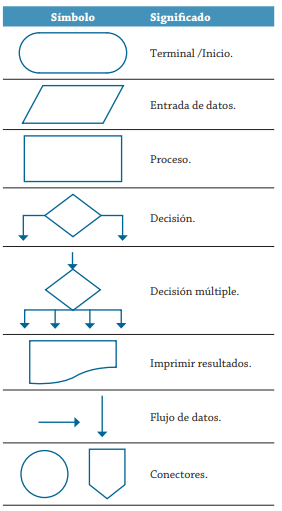
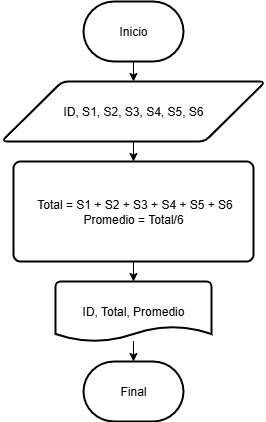
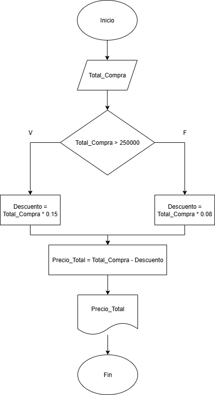
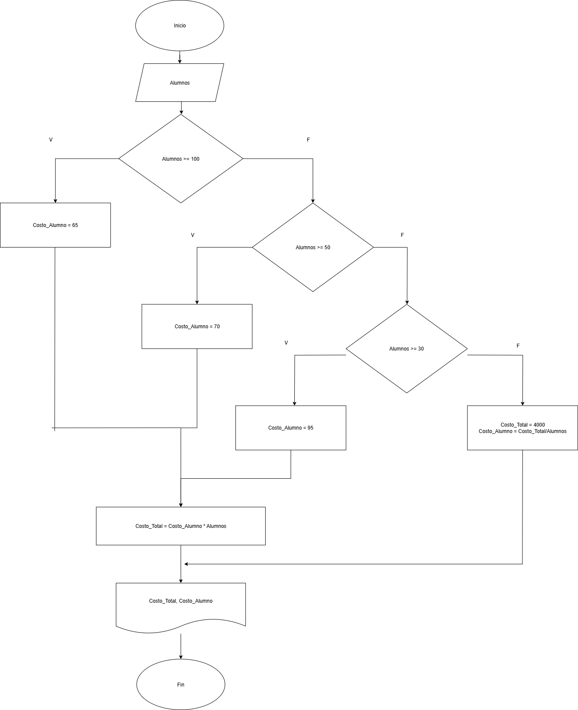
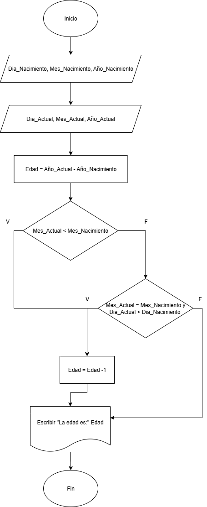

## __Pseudocódigo.__
## Ejercicio 1: 
 ## 📊 Símbolos utilizados en diagramas de flujo (programación).

Los diagramas de flujo son representaciones visuales de algoritmos o procesos que utilizan símbolos estandarizados. A continuación se detallan los más comunes:

### 🔹 Símbolos básicos:

| Símbolo | Nombre          | Función                                              |
|--------|------------------|------------------------------------------------------|
| ⭕      | Inicio / Fin     | Marca el comienzo o el final del proceso            |
| ▭      | Proceso / Acción | Representa una operación o instrucción              |
| 🔷      | Decisión         | Indica una pregunta con respuestas como sí/no       |
| ⬓      | Entrada / Salida | Muestra datos que entran o salen del sistema        |
| 🔗      | Conector         | Une partes del diagrama, útil en diagramas grandes  |

### 🧠 Otros símbolos útiles

- 📄 **Documento**: Representa un informe o archivo generado.
- 🖐️ **Entrada manual**: El usuario introduce datos directamente.
- 🔁 **Límite de bucle**: Indica dónde comienza o termina un ciclo.
- ⏳ **Retardo**: Señala una pausa o espera en el proceso.

---

### 📚 Recursos adicionales

- [Lista completa en SmartDraw](https://www.smartdraw.com/flowchart/simbolos-de-diagramas-de-flujo.htm)
- [Ejemplos en Lucidchart](https://www.lucidchart.com/pages/es/simbolos-comunes-de-los-diagramas-de-flujo)
---

_Fuente: [copilot.microsoft.com](copilot.microsoft.com)_

---
A continuación, se adjunta un recorte del archivo PDF "algoritmos.pdf" compartido por el docente. Esta, contiene más símbolos importantes al momento de realizar un diagrama de flujo:



---
## Ejercicio 2: 
Analicemos el siguiente problema y representemos su solución mediante un algoritmo secuencial.

- Construye un algoritmo que, al recibir como datos **el ID** del empleado y los seis primeros sueldos del año, calcule el ingreso total semestral y el promedio mensual, e imprima el ID del empleado, el ingreso total y el promedio mensual.

### Solución: 

### Pseudocódigo.
``` 
Inicio
Leer ID, S1, S2, S3, S4, S5, S6
Total = S1 + S2 + S3 + S4 + S5 + S6
Promedio = Total/6
Fin
``` 

### Diagrama de flujo.

---
## Ejercicio 3: 
Realice un algoritmo para determinar cuánto se debe pagar por equis cantidad de lápices considerando que si son 1000 o más el costo es de $85 cada uno; de lo contrario, el precio es de $90. Represéntelo con el pseudocódigo y el diagrama de flujo.

### Análisis.

|Variables     | Tipo       | Comentario                   |
|--------------|------------|------------------------------|
|Lápices       | Entrada    | Cantidad de lápices          |
| Precio       | Salida     | Precio total de los lápices  |
| valor_unidad | Intermedia | Valor unitario de cada lápiz |
|$85, $90        | Constantes | Estas variables son fijas    |

## Pseudocódigo
```
Inicio
Leer Lápices
Si Lápices >= 1000:
    valor_unidad = 85
Si no 
    valor_unidad = 90
Fin Si
Precio = Lápices * valor_unidad
Escribir "El valor total es:", Precio
Fin
```
### Diagrama de flujo.


---
## Ejercicio 4:
Un almacén de ropa tiene una promoción: por compras superiores a $250 000 se les aplicará un descuento de 15%, de caso contrario, sólo se aplicará un 8% de descuento. Realice un algoritmo para determinar el precio final que debe pagar una persona por comprar en dicho almacén y de cuánto es el descuento que obtendrá. Represéntelo mediante el pseudocódigo y el diagrama de flujo.

### Análisis.

| Variables | Tipo | Comentario |
|-----------|------|------------|
|Total_Compra | Entrada | Valor de la compra |
| Descuento | Salida | Este es el descuento según el valor de la compra
| Precio_Total | Salida | El valor final a pagar por el cliente, incluyendo el descuento
| 15%, 8%, $250000 | Constantes | Descuentos y valor límite | 

### Pseudocódigo.
```
Inicio
Leer Total_Compra
Si Total_Compra > 250000:
    Descuento = Total_Compra * 0.15
Si no 
    Descuento = Total_Compra * 0.08
Fin Si
Precio_Total = Total_Compra - Descuento
Escribir "Valor a pagar:", Precio_Total
Fin
```

### Diagrama de fujo.

---
## Ejercicio 5:
El director de una escuela está organizando un viaje de estudios, y requiere determinar cuánto debe cobrar a cada alumno y cuánto debe pagar a la compañía de viajes por el servicio. La forma de cobrar es la siguiente: si son 100 alumnos o más, el costo por cada alumno es de $65.00; de 50 a 99 alumnos, el costo es de $70.00, de 30 a 49, de $95.00, y si son menos de 30, el costo de la renta del autobús es de $4000.00, sin importar el número de alumnos.

### Análisis.
| Variable | Tipo | Comentario |
|----------|------|------------|
| Alumnos | Entrada | Se indica cuál es la cantidad de alumnos |
| Costo_Alumno | Salida | Este es el costo dependiento la cantidad de alumnos |
| Costo_Total | Salida | Costo total: costo por alumnos más costoautobus | 
| (Todo expresado en cantidad de alumnos) 100, 50 a 99, 30 a 49 | Constante | Rangos de alumnos para los cuales el costo es variable |

### Pseudocódigo.
```
Inicio
Leer Alumnos 
Si Alumnos >= 100:
    Costo_Alumno = 65
    Costo_Total = Costo_Alumno * Alumno
Si no:
    Si Alumnos >= 50:
        Costo_Alumno = 70
        Costo_Total = Costo_Alumno * Alumno
    Si no:
        Si Alumnos >= 30:
            Costo_Alumno = 95
            Costo_Total = Costo_Alumno * Alumno
        Si no:
            Costo_Alumno = 4000 / Alumnos
            Costo_Total = 4000
        Fin Si
    Fin Si
Fin Si
Escribir "El costo total del viaje es", Costo_Total
Fin
```

### Diagrama de flujo.


## Ejercicio 6: Tarea.
Crear un pseudocódigo y un diagrama de flujo para el siguiente proceso:
Ingresar día, mes y año de nacimiento (son variables de entrada). Ingresar día, mes y año actual, es decir, la fecha actual (son variables de entrada). 
Calcular edad (variable de salida).

### Pseudocódigo.
```
Inicio
Leer Día_Nacimiento, Mes_Nacimiento, Año_Nacimiento
Leer Día_Actual, Mes_Actual, Año_Actual
Edad = Año_Actual - Año_Nacimiento
Si Mes_Actual < Mes_Nacimiento:
    Edad = Edad -1
Si no
    Si (Mes_Actual = Mes_Nacimiento) y (Dia_Actual < Dia_Nacimiento):
        Edad = Edad -1 
    Fin Si
Fin Si
Escribir "La edad es: ", Edad, " años"
Fin
```

### Diagrama de Flujo.
